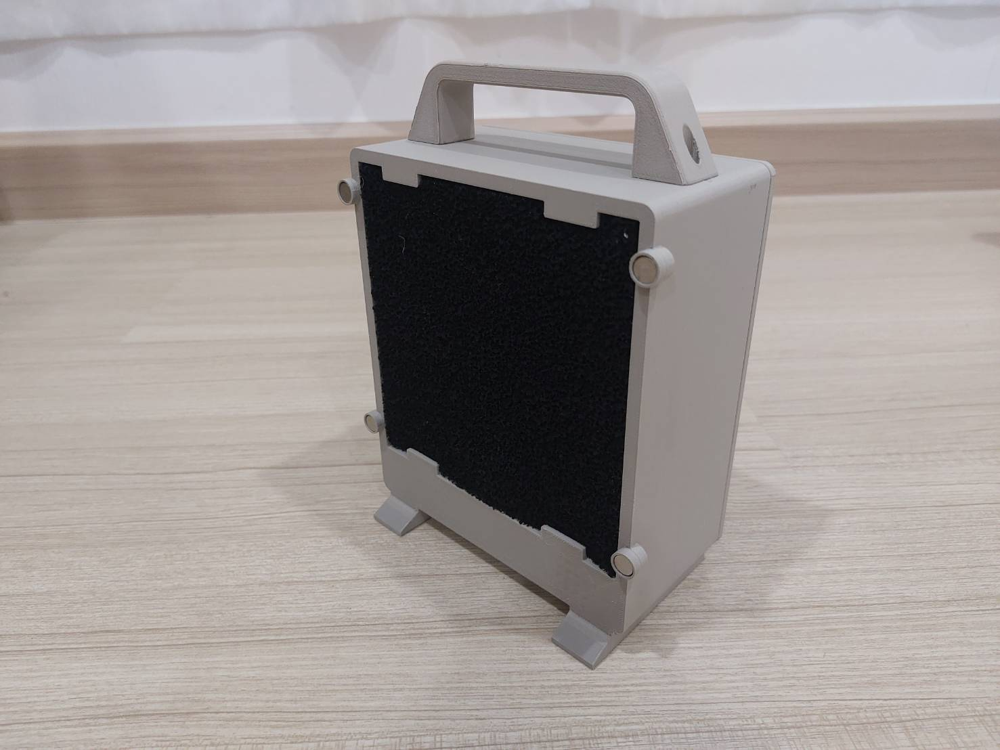
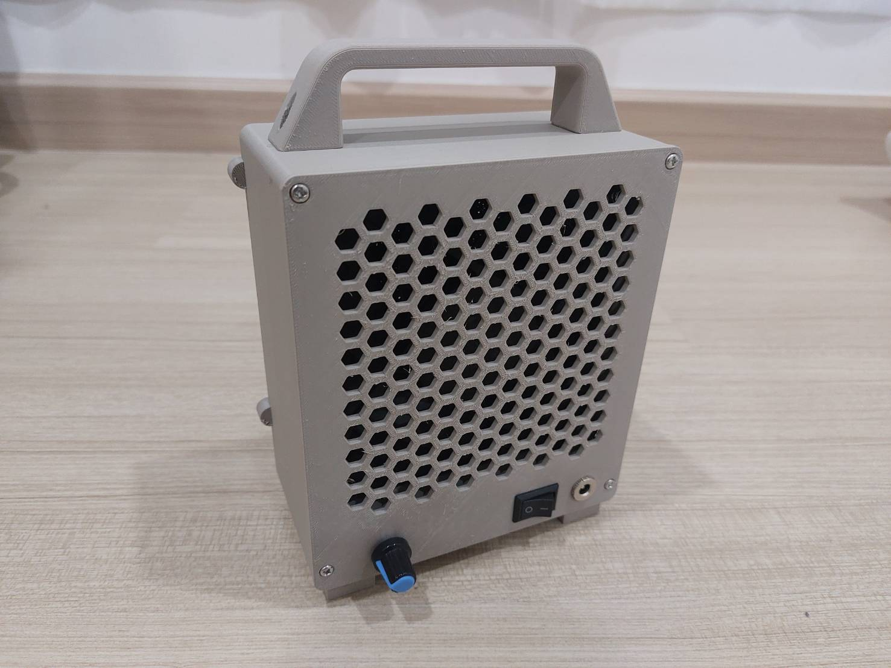
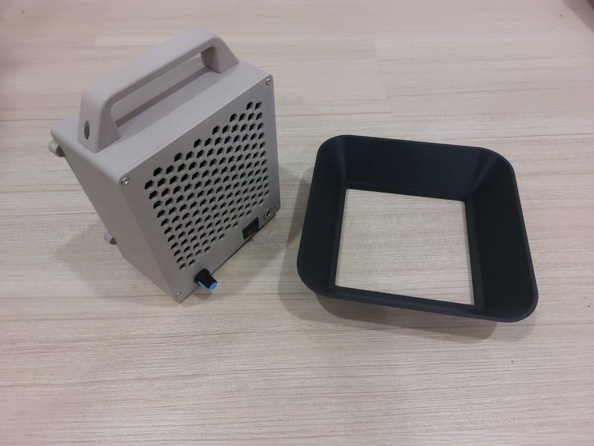
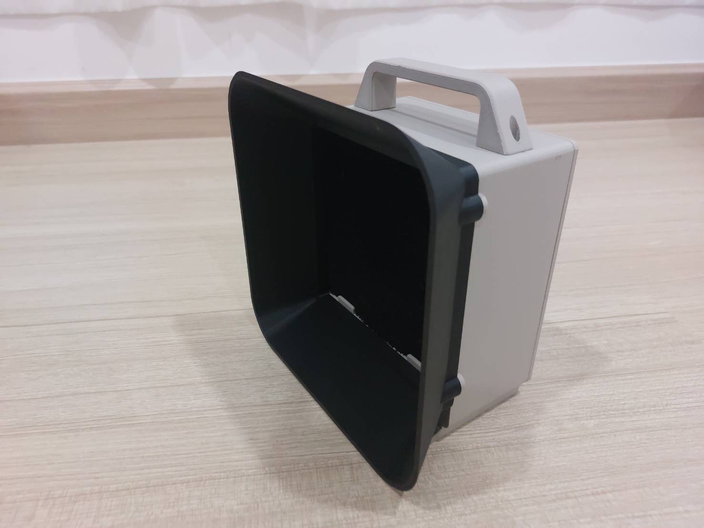

# DIY Fume Extractor

## Project status: Finished 9/07/2026 
## Start: 1 July 2026
## expected time : 10 days(including shipping time)

## Due date: 14 July 2026
# Project's objectives
1. well... extract the fume obviously.
2. learn about different types of fan (high static pressure)
3.  learn how to use magnet in 3d printed part 
4. For fun 

# Proprietary product list
1.  YIHUA 948D-Q-I Filter A1001 (850 baht) :  https://shopee.co.th/product/62968304/20124764817?gads_t_sig=gqRjZGVrxHCFomtpsTE0MjUxOnRzc19zZGtfa2V5omt20QABpGFsZ2_SAAAAZKNkZWvAomN0xEAAAAAM_NxfHGgeczprZ[...]
2.  

# Project Plan: DIY Fume Extractor

# 1. Filtration Stack (3-Layer System)
### Layer 1: Pre-Filter (White Pad)

Purpose: Traps large visible smoke particles and sticky flux residue.

Why: Prevents heavy rosin soot from clogging the expensive HEPA filter within weeks.

### Layer 2: HEPA Filter (Dense Pleated Paper)

Purpose: Traps 99.95%+ of microscopic particulate matter (down to 0.3 microns).

Why: Blocks toxic metal oxides carried in the smoke (lead and lead-free residues).

## Layer 3: Activated Carbon Filter (Granules/Pellets)

Purpose: Absorbs invisible gases, chemical vapors, and odors.

Why: Neutralizes hazardous Volatile Organic Compounds (VOCs) that pass straight through HEPA filters.

##  2. Enclosure & Mechanical Design
The main housing will be 3D printed. PETG will be used for rigid structural components, and TPU will be used for custom gaskets to ensure airtight seals.

* Integrated Features:
	Power & Control:

	Latching rocker switch with an integrated LED power indicator.

	Potentiometer knob for manual fan speed adjustment via PWM.

	Digital voltage indicator to monitor power input.

	Standard 12V DC barrel jack for power supply.

* Ergonomics & Maintenance:

	Toolless open/close lid for quick, effortless filter replacements.

	Adjustable tilt stand to optimize the intake angle on the workbench.

	**Interchangeable Intake Modules (Magnetic Attachment):

	Mode A (Bench Work): A short, wide funnel for close-range desktop soldering.

	Mode B (Extended Reach): A flexible aluminum duct pipe adapter for routing exhaust over longer distances.

## Air  flow layout 
1. The intake hood 
	1. 3d printed funnel/ vent duct pipe 

2. The filter element
	1. activated carbon filter (hakko a0001 carbon filter)

3. The fan base unit
	1. arctic 120mm fan

#  BOM

| Components                                  | quantity     | price per unit baht)      | link                                                                                                         [...]
| ------------------------------------------- | ------------ | ------------------------- | ------------------------------------------------------------------- [...]
| ARCTIC P12 PRO PST(140 x 140 x 27 mm)       | 1            | 240 ( included discount ) | https://shopee.co.th/ARCTIC-P12-PRO-PST-BLACK-(Computer-fan-%E0%B8%9E%E0%B8%B1%E0%B8%94%E0%B8%A5%E0%B8%A1%E0%[...]
| pwm motor cotroller                         | 1            | 19                        | https://shopee.co.th/PWM-DC-%E0%B9%82%E0%B8%A1%E0%B8%94%E0%B8%B9%E0%B8%A5%E0%B8%9B%E0%B8%A3%E0%B8%B1%E0%B8%9A[...]
| activated carbon filter (hakko H491F-A1001) | 1            | 188(included discout)     | https://shopee.co.th/%E0%B9%81%E0%B8%9C%E0%B9%88%E0%B8%99%E0%B8%81%E0%B8%A3%E0%B8%AD%E0%B8%87%E0%B9%80%E0%B8%[...]
| DC barrel jack 12v 5.5x2.1 mm               | 1            | 11                        | https://shopee.co.th/%E0%B9%81%E0%B8%88%E0%B9%8A%E0%B8%84%E0%B9%80%E0%B8%AA%E0%B8%B5%E0%B8%A2%E0%B8%9A-DC-5.5[...]
| M4x35 bolt (for fan mounting)               | 4            | 15                        | https://shopee.co.th/%E0%B8%AB%E0%B8%B1%E0%B8%A7%E0%B8%88%E0%B8%A1-%E0%B8%AA%E0%B9%81%E0%B8%95%E0%B8%99%E0%B9[...]
| 12v dc power supply                         | already have |                           | -                                                                                                            [...]
| 8x2mm magnets                               | 8            | 18                        | https://shopee.co.th/%E0%B8%82%E0%B8%B2%E0%B8%A2%E0%B8%AA%E0%B9%88%E0%B8%87-%E0%B8%8A%E0%B8%B8%E0%B8%94-5-%E0[...]
|                                             |              |                           |                                                                                                              [...]
|                                             | Total        | 240+19+188+11+15+18=490   |                                                                                                              [...]

# Timeline  

	 Wed 1: Write project objectives and project plan and reference (if any)
	 Thu2 - Sat 4 : Listing out and ordering required component
	 Sun 5 Finish frame design
	 Mon 6 Finish 3d print the frame 
	 Tue 7 wiring soldering test 
	 Wed 8 - Tue 11 troubleshooting (if any)

# Reflections
### The "4-Q" Reflection Framework

Don't just summarize what you did; analyze how you did it. Use these four questions to guide your writing:

1. **What was the technical delta?** Where did your simulation (MuJoCo/Gazebo) deviate from your initial expectations or physical reality?
    
2. **Where was the bottleneck?** Did the issue lie in the hardware selection, the software architecture (ROS 2 nodes/topics), or the design phase?
    
3. **What was the "hidden" cost?** Consider time spent debugging environments, managing dependencies (like those tricky ROS 2/CMake configurations), or CAD iterations.
    
4. **What is the one thing I would change?** If you had to start this project again from scratch using the knowledge you have now, what is the single biggest architectural or process-based change you [...]

Let's start with project summary. So the goal of this project is simply to make my own fume extractor  because the name brand ones are cost 1000 of dollars i would rather make it my self and to le[...]

4Q
1. Next, let's start with what is the technical delta (in this case the cad design and the real one) and honestly it performs surprisingly well considered the total cost which is about like a 500 bath[...]

2. Next, where was the bottleneck. Well, even though the fan it self is very powerful ; however, as you work further away from the device the static pressure drops drastically so in some cases this mi[...]

3. what was the hidden cost. Definitely the filter it cost me 6 dollars which is ridiculously expensive considered it quantity and it fact i just fount the exactly same one in aliexpress which cost le[...]

4. What i would change is to make use the bigger or the one that rated to have more static pressure fan and also i would like to detachable alluminium air duct to allowing  the air to flow outside the[...]

# Problem encountered
1. well. it not really a problem.It almost inevitable which is the print time this case 
for the main case it take 11hr to print.2 hr for the rear lid and 3 hr for the air funnel. So the total of almost 15 hr !! 

# What i have learn 
1. activated carbon filter is very still(i though it was soft) which lead to tolerance mismatch
2. do not print the lid before the case because if the dimension of the case is change you have to print the lid again anyway unless you finalize the design first.

# CAD design

# To Real

